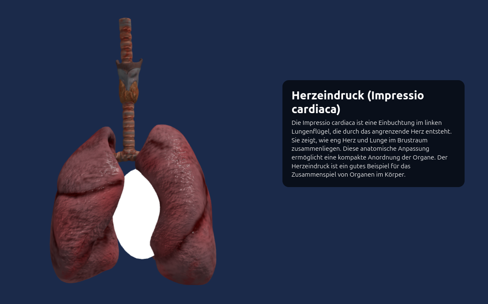

# ORGANZ_QUIZ - ein 3D Anatomie Lernspiel 


## Projektbeschreibung

Das Organ Quiz ist eine prototypische, interaktive Webanwendung auf Basis von Three.js, die darauf abzielt, anatomisches Wissen auf spielerische Weise zu vermitteln. Nutzer:innen betrachten ein dreidimensionales Modell eines menschlichen Organs und müssen anhand gezielter Quizfragen bestimmte anatomische Strukturen per Click korrekt identifizieren.

Die Anwendung kombiniert eine 3D-Visualisierung mithilfe von glTF-Modellen, eine integrierte Quiz-Logik sowie eine interaktive Benutzeroberfläche. Durch die klare Trennung von Darstellung, Logik und Benutzerinteraktion folgt das Projekt einer modularen JavaScript-Architektur. Aufgrund dieses modularen Aufbaus ist die Anwendung leicht erweiterbar und skalierbar. Weitere Organe und zusätzliche Fragen können ohne grundlegende Änderungen an der bestehenden Struktur integriert werden; hierfür müssen lediglich die entsprechenden Einträge in der OrganConfig sowie im Questions-Modul ergänzt werden.

Dieses Projekt entstand im Rahmen des Moduls B41 Computergrafik unter der Leitung von Prof. Dr.-Ing. Thomas Jung an der HTW Berlin im Wintersemester 2025/26.


## Verwendete Technologien

- **JavaScript (ES6 Modules)**
- **Three.js** – 3D-Rendering
- **glTF** – 3D-Modellformat
- **HTML / CSS** – UI & Layout
- **Modulare Projektstruktur**

## Projektstruktur

```text
/assets
├─ /images
│  └─ welcome_page.png
├─ /models
│  ├─ brain.gltf
│  ├─ heart.gltf
│  ├─ intestine.gltf
│  └─ lungs.gltf

/src
├─ /anatomy
│  ├─ AnatomyScene.js      # Modelle und Targets laden, Licht, Positionen
│  └─ OrganConfig.js       # Organ-Metadaten und Annotationen
│
├─ /core
│  ├─ App.js               # Startpunkt der App
│  ├─ CameraManager.js     # Kamera-Steuerung
│  ├─ InputManager.js      # Spieler-Input
│  ├─ RendererManager.js   # Three.js Renderer
│  └─ SceneManager.js      # Szenenverwaltung
│
├─ /quiz
│  ├─ Questions.js         # Fragenpool & Texte
│  └─ QuizManager.js       # Quiz-Logik
│
├─ /ui
│  └─ UI.js                # Buttons & Menüs
│
├─ main.js                 # Einstiegspunkt
├─ index.html              # Webseite
└─ style.css               # Styling

```

## Clickbarkeit der anatomischen Strukturen

Die Interaktion mit den anatomischen Zielstrukturen erfolgt über unsichtbare, klickbare 3D-Objekte, die an definierten Positionen innerhalb des jeweiligen Organmodells platziert sind. Diese Objekte fungieren als sogenannte Hitboxen und sind räumlich an die zu identifizierenden anatomischen Strukturen gebunden.
Die Erkennung von Klicks wird mithilfe eines Raycasters realisiert, der Mausklicks aus dem Kameraraum in die 3D-Szene projiziert und prüft, ob eine dieser Hitboxen getroffen wurde. Dadurch ist eine präzise und performante Interaktion möglich, ohne die eigentlichen Organmodelle zu verändern.




## Quellen der verwendeten Assets

###  Herz

**Titel:** Human Heart  
**Quelle:** https://www.blenderkit.com/get-blenderkit/652dce3c-92cc-4c9c-acce-81c765d810d3/  
**Plattform:** BlenderKit  

**Lizenz:** BlenderKit License  
**Lizenzinformationen:** https://www.blenderkit.com/docs/licenses/

Das verwendete Herzmodell stammt aus der BlenderKit-Bibliothek.  
Die Nutzung erfolgt im Rahmen der geltenden BlenderKit-Lizenzbedingungen.  
Das Modell wird ausschließlich zu nicht-kommerziellen, edukativen Zwecken verwendet.


### Gehirn

**Titel:** Human brain, Cerebrum & Brainstem  
**Autor:** FrankJohansson  
**Quelle:** https://sketchfab.com/3d-models/human-brain-cerebrum-brainstem-0aa0e33c5c854d1bab7bac9e1c7acaec  
**Lizenz:** CC-BY-4.0  
**Lizenzlink:** http://creativecommons.org/licenses/by/4.0/

**Attribution:**  
This work is based on *"Human brain, Cerebrum & Brainstem"*  
by FrankJohansson (https://sketchfab.com/pranktoy)  
licensed under CC-BY-4.0 (http://creativecommons.org/licenses/by/4.0/)

---

###  Dünn- und Dickdarm

**Titel:** Small and large intestine  
**Autor:** antonia.sundberg  
**Quelle:** https://sketchfab.com/3d-models/small-and-large-intestine-8a1ca8e3ca224cdeb9264674416bde38  
**Lizenz:** CC-BY-4.0  
**Lizenzlink:** http://creativecommons.org/licenses/by/4.0/

**Attribution:**  
This work is based on *"Small and large intestine"*  
by antonia.sundberg (https://sketchfab.com/antonia.sundberg)  
licensed under CC-BY-4.0 (http://creativecommons.org/licenses/by/4.0/)

---

### Lunge

**Titel:** Realistic Human Lungs  
**Autor:** neshallads  
**Quelle:** https://sketchfab.com/3d-models/realistic-human-lungs-ce09f4099a68467880f46e61eb9a3531  
**Lizenz:** CC-BY-4.0  
**Lizenzlink:** http://creativecommons.org/licenses/by/4.0/

**Attribution:**  
This work is based on *"Realistic Human Lungs"*  
by neshallads (https://sketchfab.com/neshallads)  
licensed under CC-BY-4.0 (http://creativecommons.org/licenses/by/4.0/)

## Externe Quellen & Inspiration

**KI-Unterstützung:**  
ChatGPT (OpenAI) wurde im Rahmen des Projekts als unterstützendes Hilfsmittel zur technischen Recherche, zur Überprüfung von Lösungsansätzen sowie zur sprachlichen Präzisierung der Dokumentation eingesetzt.

### YouTube Tutorials
- **Three.js Raycasting Tutorial for Beginners – Mouse Picking & Selection**  
  https://www.youtube.com/watch?v=QATefHrO4kg

- **Three.js Raycasting for Mouse Picking [Checkers 3] – Raycaster Einsatz**  
  https://www.youtube.com/watch?v=3SGdxk7HMGw

- **Trigger Action When Clicking an Object – Click Events in Three.js**  
  https://www.youtube.com/watch?v=XkZSAkjM4-A

- **Add an Interactive 3D Model to Your Website – glTF Laden & Interaktion**  
  https://www.youtube.com/watch?v=aOQuuotM-Ww


### GitHub
- **threejs-interactive-object – Interaktive Objekte vereinfachen**  
  https://github.com/MasatoMakino/threejs-interactive-object

- **three.js Haupt-Repository – Offizielle Quelle der Bibliothek**  
  https://github.com/mrdoob/three.js


### StackOverflow / Foren
- **Making imported 3D objects clickable with Three.js – Klick auf importierte Modelle**  
  https://stackoverflow.com/questions/73983106/making-imported-3d-objects-clickable-with-three-js

- **How to set clickable areas on glTF models – Modellbereiche anklickbar machen**  
  https://discourse.threejs.org/t/how-to-set-clickable-ares-on-gltf-3d-model/18046

- **Clicking on glTF models – Raycaster & glTF Interaktion**  
  https://discourse.threejs.org/t/clicking-on-gltf-models/10158

- **Using raycaster to select specific elements of glTF – Auswahl von Komponenten**  
  https://stackoverflow.com/questions/56317214/using-raycaster-to-select-specific-elements-of-gltf-add-event-listeners

